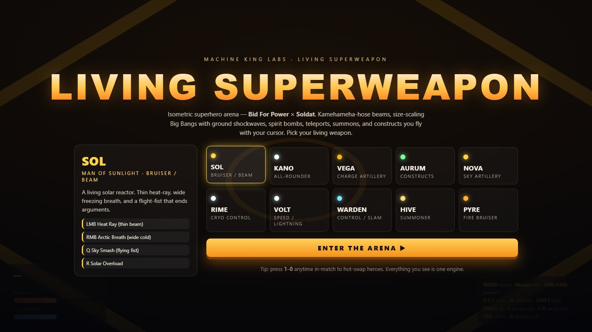
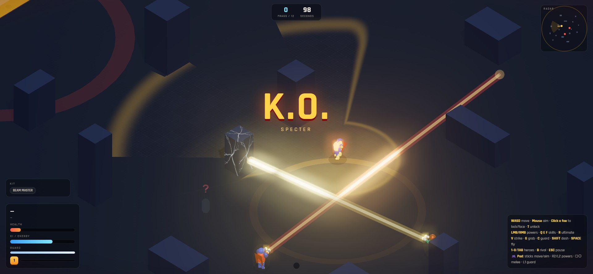
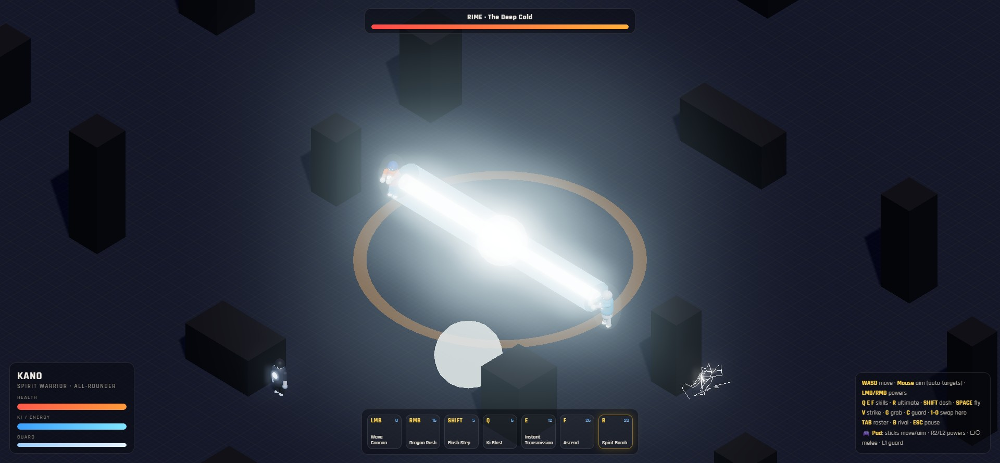
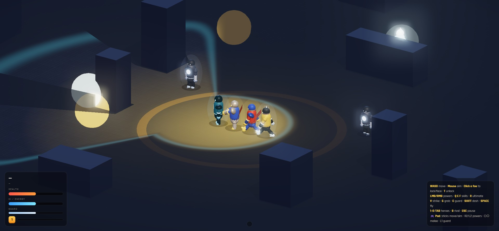
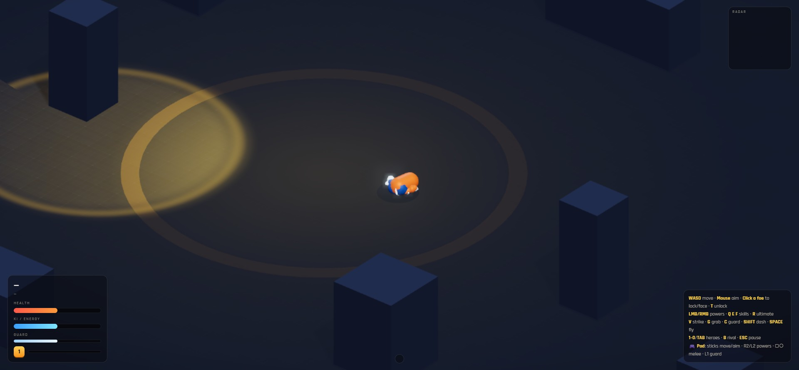
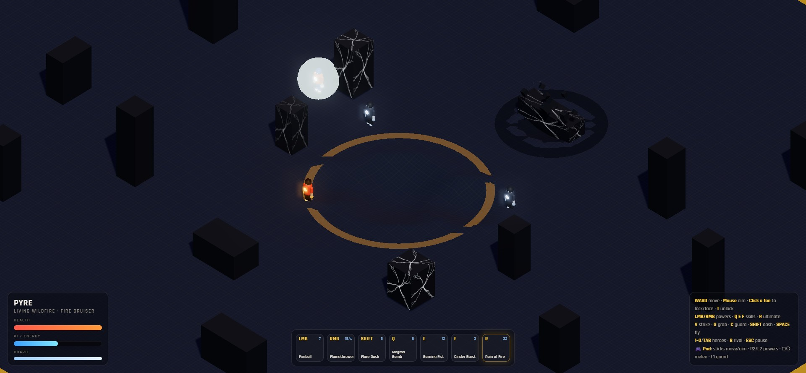
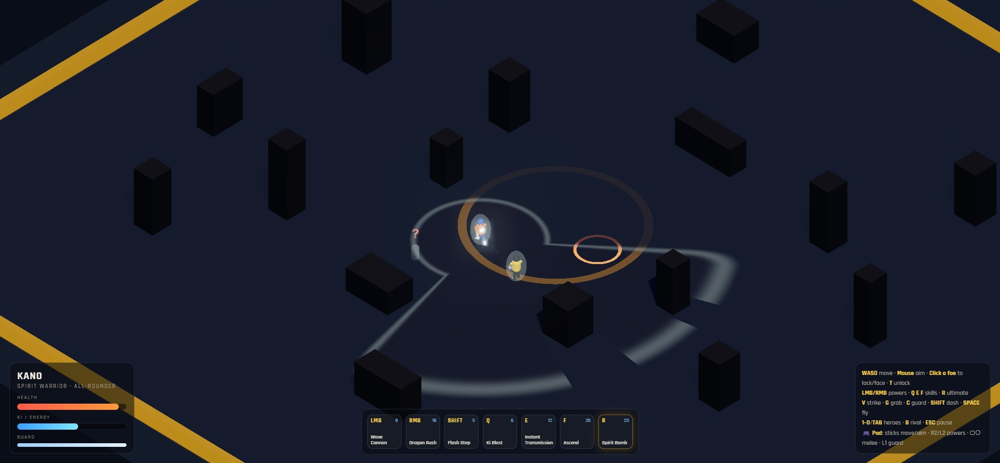
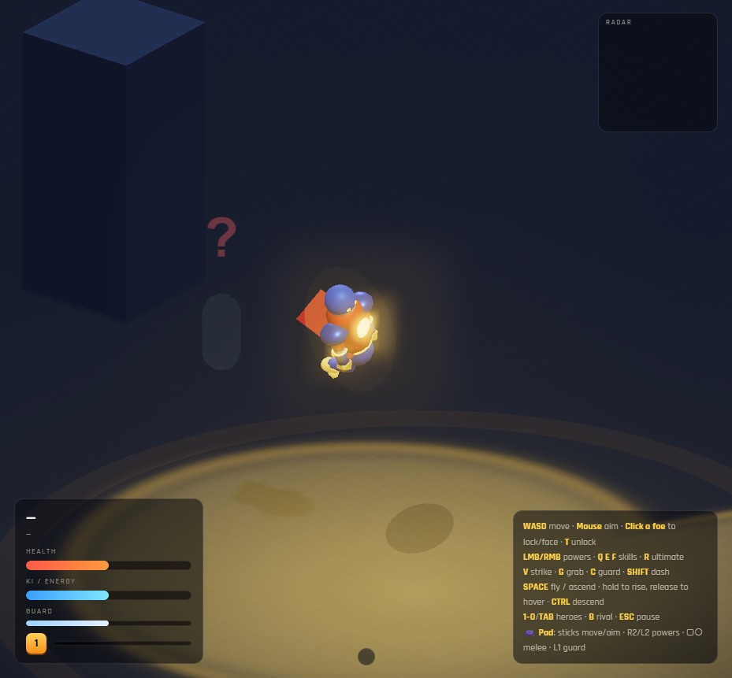
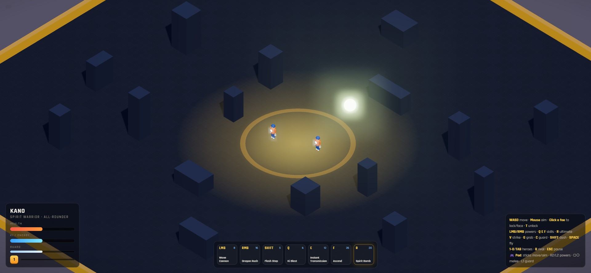

# LIVING SUPERWEAPON

An **isometric, top-down superhero action game** built in **Three.js** — inspired by
**Bid For Power** (the 3D DBZ energy-combat mod) crossed with **Soldat** (2D physics-driven
shooter). The star of the show is the **engine**: a data-driven power system where every
ability — melee, projectiles, beams, cones, charge-attacks, summons, constructs — is a small
data description that the engine brings to life with real 3D VFX, dynamic lighting, and bloom.

> Machine King Labs · demo-first, offline, runs in any modern browser.



## Gallery

<table>
<tr>
<td width="50%"><br/><sub><b>Gamified combat HUD</b> — radar/minimap, KO banner + slow-mo, directional damage, low-HP danger pulse.</sub></td>
<td width="50%"><br/><sub><b>Beam battles</b> — beams are hoses, not lasers. Opposing beams clash; the struggle point slides toward the weaker ki budget.</sub></td>
</tr>
<tr>
<td width="50%"><br/><sub><b>14 authored heroes</b> — procedural figures with capes, helmets, visors, energy crests, pauldrons, contact shadows.</sub></td>
<td width="50%"><br/><sub><b>Verlet ragdoll KOs</b> — the killing blow's knockback tumbles the body; it folds at the knees and settles into a heap.</sub></td>
</tr>
<tr>
<td width="50%"><br/><sub><b>Destructible arena</b> — blasts crater the ground and crack cover; enough damage shatters a block into rubble.</sub></td>
<td width="50%"><br/><sub><b>Fog of war</b> — you only see what your hero can. Enemies fade out and drop a "?" at their last-known spot; juke bots around cover.</sub></td>
</tr>
<tr>
<td width="50%"><br/><sub><b>Flight & levitation</b> — hold to rise, release to hover, descend to land; fight in the air with 3D aim.</sub></td>
<td width="50%"><br/><sub><b>HDR pipeline</b> — half-float composer, half-res bloom, rim lighting, gradient sky, gold arena glow, adaptive quality.</sub></td>
</tr>
</table>

---

## Run it

```bash
cd D:/lsw
npm install      # first time only (installs three)
npm run dev      # vite dev server → http://localhost:5180
```

Open **http://localhost:5180**, pick a hero, **ENTER THE ARENA**.

---

## Game modes, progression & multiplayer

Pick a **mode** and a hero on the title screen:

- **DUEL** — pure 1v1, first to **3 KOs**.
- **SURVIVAL** — **endless waves** that grow stronger each round; level up, chain kills, survive on 3 lives.
- **RUMBLE** — four-way free-for-all, first to **12 KOs** or top score when the 99s clock runs out.
- **TRAINING** — sandbox with dummies + a sparring rival, endless.

Each mode has a **top HUD bar** (KO count / wave+score+lives / frags+timer), win-and-lose conditions, and a
**VICTORY / DEFEAT end screen** with your stats and Rematch / Menu.

**Progression (gamified combat).** Every hero has a **level + XP bar** (shown by a gold level badge). You earn XP by
landing damage and scoring KOs; **level-ups boost your power and health** (capped at 10). Kills feed a **score**,
**kill streaks**, and an **announcer** — First Blood, Double/Triple KO, Rampage, Unstoppable, Godlike. Enemy level shows on
their health bar. Survival scales enemy levels by wave.

**Custom per-hero HUD.** A **kit widget** shows what makes each hero tick: HIVE's live **drone count**, AURUM/RIME's active
**construct**, SPECTER's **intangibility**, a **buff timer** during transforms, and badges for **Beam Master / Absorb /
Thorns / Invincible**.

**Local multiplayer.** Duel and Rumble support **2 players on one screen** — **P1 keyboard+mouse, P2 gamepad** — with a
camera that zooms to keep both in frame and a shared (union) vision. The player/input layer is abstracted (`game.humans`
with a `scheme`), so it's **architected for LAN**; true cross-machine netcode is the remaining layer (a WebSocket/WebRTC
sync on top of this abstraction).

## Controls

| Input | Action |
|------|--------|
| **WASD** | Move (relative to the iso view) |
| **Mouse** | Aim — attacks fire toward the cursor, **angling up/down to the target's height** |
| **Left-click a foe** | **Hard-lock** it (red triangle) — your hero always *faces* it, but attacks still follow the mouse. **T** unlocks |
| **LMB / RMB** | Primary / secondary power |
| **Q · E · F** | Skills |
| **R** | Ultimate |
| **V** | **Strike** — punch/kick combo (3rd hit launches → air juggle) |
| **G** | **Grab** — seize & throw (from behind = guaranteed + bonus) |
| **C** | **Guard** — hold to block; when safe it also charges ki |
| **SHIFT** | Dash / mobility (i-frames) |
| **SPACE** | **Fly** — hold to rise, **release to hover / levitate** |
| **CTRL** | Descend (hold) — sink back down and land |
| **1–0** | Hot-swap the first 10 heroes mid-match (all 14 via TAB) |
| **TAB** | Roster / switch screen · **ESC** pause |
| **B** | Spawn another rival · **M** mute |

### Melee trifecta (rock-paper-scissors)

**Strike ▸ beats ▸ Grab ▸ beats ▸ Guard ▸ beats ▸ Strike.**
Guarding blocks strikes to chip damage, but a Grab is unblockable; a Strike interrupts a Grab's start-up.
Per-hero variants make it deep: teleporters & phasers **break out of front grabs** (KANO, VOLT, WARDEN, APEX, SPECTER),
thorns heroes **damage whoever holds them** (TORCH, VOLT), and APEX's throws **drain life to heal him**.
A back-grab can't be escaped. **SPECTER** can spend energy to turn **intangible** and let everything pass through.

### Gamepad / PS2 controller

Plug in any standard/DualShock pad (press a button to activate it). Everything the keyboard+mouse do, the pad does:

| Pad | Action | Pad | Action |
|-----|--------|-----|--------|
| **Left stick** | Move (analog) | **Right stick** | Aim (auto-locks nearest foe in that direction) |
| **R2 / L2** | Primary / secondary power | **R1** | Dash |
| **Square** | Strike | **Circle** | Grab |
| **L1** | Guard (hold) | **Cross** | Fly / ascend (hold) · **L3** descend |
| **Triangle** | Ultimate | **D-pad ↑→←** | Q / E / F skills |
| **D-pad ↓** | Swap hero | **Start / Select** | Pause / Roster |

### Enemies fight like their counterparts

Every hero has an **AI style** true to who they're based on (`src/data/characters.js → ai`, driven by `src/engine/ai.js`):
**KANO** is a *trickster* — teleports in, fires wave cannons, blinks out when low; **VEGA** is a relentless
*beamer* that crowds you with ki blasts and Nova Bursts; **AURUM** is a *zoner* that walls up and drops
turrets; **NOVA/PYRE** are *artillery* that kite and rain fire; **VOLT/TORCH/VANGUARD** are *rushers* that blitz;
**HIVE** is a *summoner* that hides behind drones; **APEX** is a *grappler* that seeks throws to heal;
**SPECTER** *phases* to dodge. They **block, counter-beam, transform when low, and fly up to fight airborne
foes** — and every attack now **aims in 3D**, angling up at flyers and down at grounded targets.

### Field of vision (fog of war)

You only see enemies **where your character can actually see them**. A **vision cone** in your facing direction plus a
close **awareness bubble** reveal the arena; everything else is fogged dark. **Cover blocks cast vision shadows** — a foe
behind a wall vanishes. Enemies **fade out when they leave sight and drop a red "?" last-known marker**; a foe that fires a
beam or charges a big attack **gives their position away** (revealed by the light). You can't lock or target what you can't
see, and the target health-bar only shows visible foes. The **fog is a GPU shader** on the ground (cone + near radius +
per-fragment wall occlusion) — `src/engine/world.js → _buildFogOfWar`, logic in `src/engine/game.js → updateVision`.

**The AI sees too.** Bots have their own vision + memory: they hunt you, and if you **break line of sight and reposition**,
they lose you, search your last-known spot for a few seconds, then re-scan — so you can **juke them around cover**. They're
still lethal when they can see you.

### Physics

Real **AABB (Box3) collision**: cover blocks stop you, and you can **land on and fight from their tops** — verticality for
air combat. Fighters softly **push each other apart** instead of stacking. Knockback launches, flight, and a height ceiling
keep it grounded (literally).

### Flight & levitation

Flight is a real **levitation** mode, not a jump: **hold SPACE to rise**, **let go to hover** — you hang in the air with a
gentle bob instead of dropping — and **hold CTRL to descend** and touch down. Take off with a tap, cruise at altitude with a
forward lean and your legs trailing, and fight in the air (attacks aim in 3D, up at flyers and down at grounded foes).
Knockback still arcs and falls under gravity — only *you* choose when to levitate.

### Destructible environment (GeoMod-lite)

The arena takes damage. Big blasts **crater the ground** — the terrain is a subdivided mesh whose vertices are actually
displaced into a bowl (with a raised rim + scorch), Red-Faction style, **clamped in depth so you can't dig to nothing**
(the "limit"). **Cover blocks are destructible**: they build up **visible cracks** as they take hits, then **shatter into
tumbling debris + rubble** — and once gone they no longer block movement, line of sight, or vision. **Getting knocked into
a wall hard cracks it** (and you bounce off), and **sustained beams carve straight through cover**. It all **resets each
match**. `src/engine/world.js` (`crater`, `_crackTexture`, `resetTerrain`) + `src/engine/game.js` (`worldImpact`,
`damageBlock`, `shatterBlock`).

### Roster screen & hit feel

The select screen (also **TAB** in-match) is a full **stat sheet**: per-hero Power / Range / Mobility / Defense / Health /
Energy bars (derived from the data), trait tags (Thorns · Phase · Absorb · Blink · Constructs · Artillery…), and every
ability with a generated description. Cards show HP·PWR·SPD.

Melee is deliberately **violent**: every clean strike, heavy-melee, and throw fires a comic-book **impact-star burst** +
energy spray, **freezes both fighters** (hit-stop), kicks the camera, and plays a thud-and-crack; finishers add a **slow-mo**
beat and a white screen-flash. Guarded hits shrug off with a small blue spark instead.

Charge attacks (Nova Burst, Wave Cannon, Star Sphere): **hold** the button to charge, **release** to fire.
The longer you hold, the bigger, more damaging, and wider the blast — and the harder the ground shockwave.

### Ragdoll KOs

When a fighter goes down it doesn't just tip over — it becomes a **physics ragdoll**. A little verlet skeleton (a mass
at every joint, distance-constrained bones, gravity, ground + cover collision) takes over the figure and carries the
**killing blow's knockback** into a real tumble: the body launches, somersaults in the direction it was hit, sprawls
across the floor, **folds at the knees and elbows**, drapes over cover, and **settles into a natural heap** before going to sleep. The camera hits a brief
**slow-mo**, a big **"K.O."** stamps the screen, and — because it obeys the same fog of war as everything else — a body
you can't see fades out. `src/engine/ragdoll.js`. (Bodies restore to a pristine rig on respawn.)

### Characters & combat HUD

The heroes are **authored procedural figures** — proper anatomy (two-bone arms and **legs that bend at the knee** as they
run, kick, land, and fly) plus per-hero silhouette flair (helmets, glowing visors, energy crests, shoulder pauldrons,
gauntlets, capes, belts) and a soft **contact shadow** that grounds them and fades as they fly. All of it rides the
ragdoll skeleton, so a downed fighter keeps its armor and cape.

The HUD is built for a fast fight: a **radar / minimap** (arena, cover, you in gold with a vision wedge, enemies in red,
and a "?" where a foe was last seen), **directional damage** flashes at the screen edge showing where a hit came from,
a pulsing **low-health danger** vignette, ability **cooldown** overlays, a live **KO banner**, level/XP, kill streaks,
combo counter, and per-hero kit chips.

---

## The signature mechanic: beams are hoses, not lasers

Real "eye-beam" lasers move too fast to feel like anything. Here every beam is a **wave-hose**:
a bright **projectile tip** races out at a finite speed, *dragging a thick beam behind it*, and you can
**steer it with your cursor** while it's firing. Thin heat-rays are fast and precise; wide energy waves
are slower and shove enemies back. (`src/engine/projectiles.js → BeamHose`.)

### Beam battles & the ki budget

Point your beam into an enemy's beam and they **clash** — a bright struggle point forms between them and
**slides toward the weaker beam**. Strength = the character's **beamMight** × their power buff × **how much
of their ki budget is left** (energy "put into" it). Ki is a real budget: beams drain it, clashing drains it
faster, and a drained caster's beam weakens and **gets overpowered** — a beam to the face. So you can't just
spam a beam: hold it too long and you'll lose the struggle. **Beam Masters** (SOL · KANO · VEGA · NOVA · APEX)
push harder for their ki; melee heroes lose beam struggles. Enemies now **block beams** with Guard, or
**fire back** to start a clash. Guard well to recover ki, then commit.

---

## Roster (14)

Each hero is a different stress-test of the engine. **No two kits share a shape.**

| # | Hero | Archetype | Showcases |
|---|------|-----------|-----------|
| 1 | **SOL** — Man of Sunlight | solar paragon | thin **Heat Ray** beam · wide **Arctic Breath** cold cone · flying **Sky Smash** fist · **Solar Overload** buff |
| 2 | **KANO** — Spirit Warrior | spirit martial artist | chargeable **Wave Cannon** (wave cannon) · **Comet Rush** teleport-combo · **Snap Transit** · **Star Sphere** |
| 3 | **VEGA** — Fallen Prince | proud beamer | left-right **Volley** volley · size-scaling **Nova Burst** (ground shockwave + lightning) · **Violet Lance** · **Final Arc** |
| 4 | **AURUM** — The Willbearer | construct zoner | **cursor-steered constructs**: rocket **Fist**, falling **Hammer**, **Barrier** wall, **Sentry** turret |
| 5 | **NOVA** — Star Sovereign | cosmic artillery | **Star Lance** beam · **Nova Core** charge · **Solar Wind** push · **Meteor Storm** ultimate |
| 6 | **RIME** — The Deep Cold | cryomancer | **Frost Breath** slow-cone · **Ice Wall** · **Cryo Beam** · **Absolute Zero** charge |
| 7 | **VOLT** — The Overclock | speedster | **Lightning Flurry** · fast **Arc Beam** · **Blink** · **Overclock** haste |
| 8 | **WARDEN** — Gravity Anchor | telekinetic | wide **Force Push** · **Graviton** lob · **Singularity** implosion · **Collapse** |
| 9 | **HIVE** — The Conclave | summoner | **Drone Swarm** · **Sentinel** turret · **Hunter Pack** · **Overmind** |
| 10 | **PYRE** — Living Wildfire | fire bruiser | lobbed **Fireball** · **Flamethrower** cone · **Magma Bomb** charge · **Rain of Fire** |
| 11 | **TORCH** — The Human Flame | fire flyer | fast fire-flyer · **Flame Jet** · **Fire Blast** cone · thorns (**burns grabbers**) · **Supernova** |
| 12 | **APEX** — The Perfect Being | absorbing grappler | **Wave Cannon** · **absorbing throws** (lifesteal) · **Regenerate** · **Afterimage** blink · Perfect Wave |
| 13 | **SPECTER** — The Synthezoid | phasing synthezoid | **Intangibility** (energy phase) · **Density Punch** · **Solar Beam** · **Max Density** |
| 14 | **VANGUARD** — The Invincible | invincible flyer | **Flying Tackle** · **Sky Combo** aerial rush · **Invincible** i-frames · **Eye Beam** |

---

## Engine architecture

```
src/
  main.js                 bootstrap: loop, global keys, title→match wiring
  core/
    util.js               math (lerp, damp, angles, hex mixing)
    input.js              keyboard + mouse (edges, CSS-space cursor)
    audio.js              WebAudio synth SFX (no assets: blast/zap/boom/charge/…)
  data/
    characters.js         the 14 heroes — pure data (stats + ability kits)
  engine/
    world.js              HDR composer + half-res bloom, adaptive quality, iso camera, lights, sky, arena, cover, craters, fog
    particles3d.js        GPU-additive point particle system (single buffer)
    vfx.js                explosions, shockwaves, lightning, rings, scorch, flashes
    entity.js             Fighter: authored figure (+per-hero flourishes), physics, flight, combat, KO
    ragdoll.js            verlet ragdoll — drives the figure meshes into a physics tumble on KO
    projectiles.js        Projectile · BeamHose (hose) · SpiritBomb
    abilities.js          the ability TYPES registry (15 power types)
    melee.js              the Strike / Guard / Grab trifecta + per-hero variants
    summons.js            Minion (drones) · Construct (fist/hammer/wall/turret)
    ai.js                 generic combat brain — emits the same "intent" a player does
    hud.js                DOM HUD + character-select screen
    game.js               orchestrator: entities, control, combat helpers, update loop
```

**How a power works:** a character's slot (`lmb`, `q`, …) holds an ability *definition* like
`{ type:'charge', name:'Nova Burst', maxCharge:2.4, minR:1.3, maxR:6.2, dmgMin:22, dmgMax:84, shock:true }`.
Each frame the engine builds an **intent** (from the keyboard/mouse for the player, from `ai.js` for bots)
and dispatches it through `abilities.js → TYPES[type]`. Player and AI run the *exact same* code path.

**Ability types:** `melee · rush · projectile · volley · beam · cone · charge · growingorb ·
teleport · dash · summon · construct · buff · meteor`. Adding a new hero is pure data; adding a new
*kind* of power is one new entry in the `TYPES` registry.

**Combat feel:** knockback launches (Soldat-style), hitstop on heavy blows, camera shake + punch-zoom
scaled to impact, ki economy (spend to cast, build by fighting / holding **C**), and full flight.

---

## Rendering & performance

The look and the frame budget were tuned together — it should be **richer *and* faster** than the first build.

- **HDR pipeline.** Post-processing runs through an `EffectComposer` on a **half-float HDR** render target with
  **MSAA** baked in, so bright energy VFX bloom smoothly instead of clipping to white. Canvas anti-aliasing is
  **off** — the composer already resolves MSAA, so leaving it on was pure wasted GPU.
- **Half-resolution bloom.** `UnrealBloomPass` — the single most expensive pass — runs at **half resolution**.
  It's roughly **4× cheaper** and, because bloom is a soft glow, visually identical.
- **Adaptive resolution.** A frame-time average drives a 3-tier quality manager: on a strong GPU it renders at full
  pixel ratio with full bloom; if frames get expensive it steps the resolution and bloom down automatically, so the
  game stays smooth on weaker hardware and crisp on strong hardware. (On an RTX 4090: ~2 ms per full frame, locked 60.)
- **Lit, not flat.** Warm key **sun** + a cool **back-rim** light peel characters off the dark floor; a hemisphere
  light tints sky-up vs ground-up. A gradient **sky dome**, a gold **center glow** on the arena, a richer textured
  ground, atmospheric fog, and a soft **vignette** frame the action without dimming the fight.

## Design rules honored

- **Beams are hoses** (traveling tip), never instant lasers.
- **Charge = scale**: hold longer → bigger projectile, more damage, wider blast radius, harsher
  ground shockwave + lightning.
- **No purple, ever** — palette is warm-neutral dark + gold/amber, with per-hero non-purple accents.
- **Authored arcade look**, not a generic template: gold-on-ink, `Rajdhani` display type, bloom-lit energy.

## Roadmap ideas

- Destructible cover, arena hazards, KO ring-outs.
- Per-hero unique models (swap the primitive figure for GLTF).
- Online/local versus, combo scoring, story waves.
- Real-controlled construct chaining (fly the fist through multiple targets).
