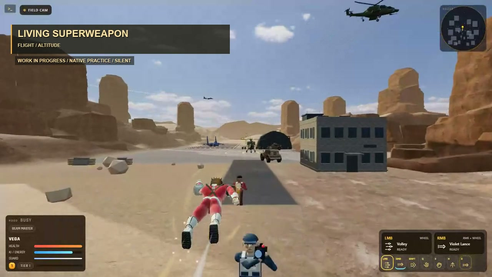

# Living Superweapon gameplay showcase

[Watch the MP4](./living-superweapon-gameplay.mp4) · [Source and trim manifest](./source-manifest.json)



A short, silent edit of actual native-input Practice recordings: superhero flight, building traversal, rifle fire and a sustained beam with hit/KO feedback. This is work in progress. The range targets are passive practice constructs; this reel does not demonstrate hostile AI combat or airborne melee/grappling.

The source recordings contain no audio. No music, generated footage or added sound effects are used. The edit preserves normal playback speed and the game HUD, with short labels and cross dissolves between separate sessions. Loading screens and editor portions are omitted. Aircraft may appear in the environment, but are not the subject of the reel.

The 37.32-second MP4 uses 1280×720 H.264 video, 25 fps, and fast-start metadata for web playback. It is approximately 8.7 MB. The JSON manifest records exact source paths, trims, evidence reports and editing limits. Original recordings remain in the local `artifacts/` tree.

To rebuild from the repository root on Windows with FFmpeg installed:

```powershell
node tools/build-showcase.mjs
```

Set `SHOWCASE_FONT` to an existing TrueType font file on other systems. Temporary intermediate clips are placed in the OS temporary directory and are not published.
